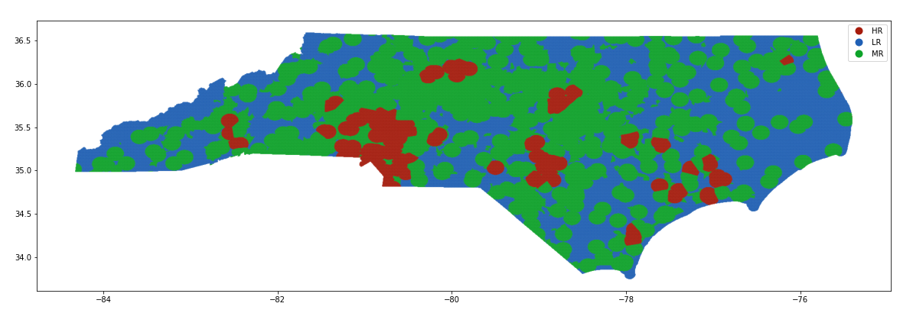
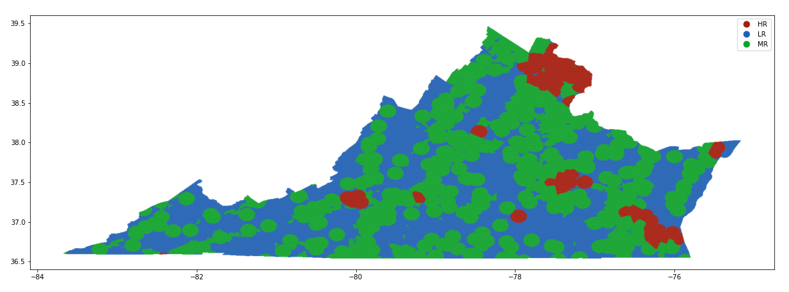
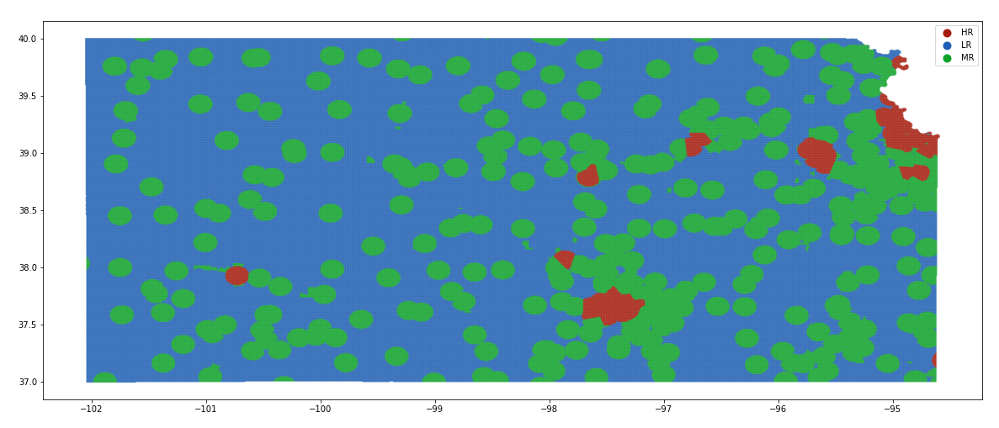

# Airborne Collision Risk Classification

Python 3.x Jupyter Notebook to quantitatively identify the airborne collision risk based on the [ASTM Committee F38 on Unmanned Aircraft Systems](https://www.astm.org/COMMITTEE/F38.htm) DAA performance standard.

- [Airborne Collision Risk Classification](#airborne-collision-risk-classification)
  - [Point of Contact](#point-of-contact)
  - [Nomenclature](#nomenclature)
  - [Introduction](#introduction)
  - [Airborne Collision Risk Classifications](#airborne-collision-risk-classifications)
    - [Low Air Risk](#low-air-risk)
    - [Medium Air Risk](#medium-air-risk)
    - [High Air Risk](#high-air-risk)
    - [Extremely Low Air Risk](#extremely-low-air-risk)
  - [Initial Setup](#initial-setup)
    - [em-core](#em-core)
    - [Anaconda](#anaconda)
    - [Scripts](#scripts)
    - [Census API key (optional)](#census-api-key-optional)
  - [Run Order](#run-order)
    - [Launch Jupyter Python Notebook](#launch-jupyter-python-notebook)
      - [Jupyter Errors](#jupyter-errors)
    - [Execute Notebook](#execute-notebook)
    - [Running without Jupyter](#running-without-jupyter)
  - [Software Details](#software-details)
    - [Input Parameters](#input-parameters)
    - [Loading Data](#loading-data)
    - [Classify Coordinates](#classify-coordinates)
  - [Example Output](#example-output)
    - [North Carolina](#north-carolina)
    - [Virginia](#virginia)
    - [Kansas](#kansas)
  - [Citation](#citation)
    - [Software](#software)
    - [LLSC](#llsc)
    - [USGS](#usgs)
  - [Distribution Statement](#distribution-statement)

## Point of Contact

We encourage the use of the [GitHub Issues](https://guides.github.com/features/issues/) but when email is required, please contact the administrators at [encounter-model-ml-admin@mit.edu](mailto:encounter-model-ml-admin@mit.edu).

## Nomenclature

Acronym | Phrase
 :--- | :---
AGL | above ground level
BVLOS | beyond visual line of sight
D&R | durability and reliability
DAA | detect and avoid
JARUS | [Joint Authorities for Rulemaking of Unmanned Systems](http://jarus-rpas.org/)
LLSC | [Lincoln Laboratory Supercomputing Center](https://www.ll.mit.edu/r-d/cyber-security-and-information-sciences/lincoln-laboratory-supercomputing-center)
SORA | Specific Operations Risk Assessment
UAS | unmanned aerial systems

## Introduction

The continuing integration of unmanned aerial system operations into the National Airspace System requires new or updated regulations, policies, and technologies to enable safe and efficient use of the airspace. Detect and Avoid (DAA) systems utilized by UASs are one such technology that is actively being standardized. To mitigate the risk of midair collisions, these systems consists a functions to sense and identify potential hazardous encounters with other aircraft and then recommend a maneuver such that the UAS avoids the other aircraft.

One standardization effort to define DAA system performance requirement is led by the [ASTM Committee F38 on Unmanned Aircraft Systems, Subcommittee F38.01 on Airworthiness](https://www.astm.org/COMMIT/SUBCOMMIT/F3801.htm). This subcommittee established [working group 62668](https://www.astm.org/DATABASE.CART/WORKITEMS/WK62668.htm) with the objective to define minimum performance standards for DAA systems applicable to smaller UAS BLVOS operations for the protection of manned aircraft in lower altitude airspace. Smaller UASs are defined in the ASTM standard as having a wingspan or equivalent of 25 feet or less.

This ASTM performance standard prescribes different requirements, such as those for DAA system availability or assurance, based on generalized airborne collision risk classifications for specific operating locations. In response, this software was developed to quantitatively classify and visualize the ASTM-based airborne collision risk classifications for specific locations. The software was not developed to identify the risk a UAS colliding with the ground or third party non-participants. Additionally while the software developers are not a civil aviation authority or air navigation service provider, this software may be used as part of a determination of the initial airborne collision risk classification. This initial determination aligns with many of the concepts described in the [JARUS 2019 SORA 2.0](http://jarus-rpas.org/content/jar-doc-06-sora-package).

## Airborne Collision Risk Classifications

The ASTM F38 WK62668 DAA performance standard discusses generalized airborne collision risk classifications. These risk classifications were derived from guidance developed by the [JARUS 2019 SORA 2.0](http://jarus-rpas.org/content/jar-doc-06-sora-package).  It is important to note that these generalized Airborne Collision Risk Classifications were created with mainly cooperative intruders in mind.  Care should be taken when using these generalized classifications to describe collision risk with non-cooperative intruders.

While the ASTM standard does not prescribe a set of requirements for each classification nor specify a method to determine air risk, it provides generalized guidance on the context for each risk classification. Given this mostly quantitative guidance, this software use open source datasets to identify and visualize air risk classes given specific latitude, longitude, and altitude positions.

For our definitions, we assume rural areas have a population density of 100 people per square mile or less. While rural areas have not been formally defined by the FAA or for [SESAR U-Space](https://www.sesarju.eu/U-space), we initially defined rural areas for low risk airspace DAA as having a population density of 100 or less. This quantitative criteria for rural areas was based on the draft D&R MOC from February 2020 or FAA brief to type certificate applicants from July 2019.

As with any generalization, when the area becomes more refined there will be specific areas where the generalized classification levels will be true, and other specific areas where the generalized classification levels will not be true. Care should be taken when using these generalized classifications to describe collision risk with non-cooperative manned aircraft since these classifications were created with primarily cooperative manned aircraft in mind. For specific operations, the UAS operator should work with the local airspace authority to ensure that the appropriate air risk classification is assigned to the operational volume. Furthermore, the software does not estimate nor make assumptions about the likelihood of a UAS encounter a cooperative transponder-equipped or noncooperative manned aircraft. In coordination with the local airspace authority, tt is possible that for a given location, the airborne risk classification could differ for cooperative transponder-equipped and noncooperative manned aircraft.

Specifically, we defined the default risk criteria, within the United States, as the following:

### Low Air Risk

- Uncontrolled airspace
- Below 500 feet AGL
- Over a rural area (100 people per square mile or less, within a US census block group)
- At least 5 nautical miles away from all aerodromes

### Medium Air Risk

- Uncontrolled airspace (no altitude ceiling)
- Below 500 feet AGL in controlled airspace (Class B, C, D)
- At least 5 nautical miles away from the center point of Class B, C, and D aerodromes
- Below 500 feet AGL over an urban area (greater than 100 people per square mile, within a US census block group)
- Below 500 feet AGL in Class E or G aerodromes

### High Air Risk

If a location fails to satisfy all the low or medium risk criteria, it is classified as high risk. We assume that these locations are where manned cooperative transponder-equipped aircraft predominately fly and/or where a smaller UAS would frequently encounter cooperative transponder-equipped manned aircraft. Elevation for a given location(latitude, longitude) is obtained by *The National Map Elevation Point Query Service (EPQS)*. If the query does not return a result for the elevation, the AGL altitude can not be calculated. In this event, the location is assigned high air risk by default.

### Extremely Low Air Risk

We do not quantitatively define or identify locations where manned aircraft manned aircraft predominately do not fly and/or were it is extremely improbable for a smaller UAS to encounter any manned aircraft.

## Initial Setup

This section specifies the run order and requirements for the initial setup of this repository. Any changes to third party software or dependencies shall be in compliance with the respective licenses.

### em-core

If you have not already, complete the initial setup associated with the [`em-core`](https://github.com/Airspace-Encounter-Models/em-core) repository. This setup will download some of the third party data files, such as the FAA airport dataset, that is used by this repository.

### Anaconda

[`Anaconda`](https://www.anaconda.com/products/individual) can be downloaded on Mac, Windows, or Linux. Select the python 3.x version. Once downloaded, to create an identical Anaconda environment to the one used in developing the code, run the code below to install all dependencies.

```bash
conda env create -f environment.yml
```

Once downloaded, to activate the Anaconda environment you will either need to run `source activate airspace` or `conda activate airspace` from the command line depending on which version of Anaconda is installed. Specifically, first activate your anaconda environment by running either:

```bash
source activate airspace
```

or

```bash
conda activate airspace
```

Note that older versions of Anaconda use `source activate <env name>` while newer versions use `conda activate <env name>`.

### Scripts

This is a set of boilerplate scripts describing the [normalized script pattern that GitHub uses in its projects](https://github.blog/2015-06-30-scripts-to-rule-them-all/). The [GitHub Scripts To Rule Them All](https://github.com/github/scripts-to-rule-them-all) was used as a template. Refer to the [script directory README](./script/README.md) for more details.

You will need to run the following script to download and process the Census block group shape files.

1. [setup](./script/README.md#scriptsetup)

### Census API key (optional)

This repository contains processed U.S. Census population density data for the year 2019. If different census data is desired, you need to reprocess the U.S. Census data. The first step is to sign up for a U.S. Census [API key](https://api.census.gov/data/key_signup.html). After signing up, ensure that you have copied the contents to the [`API.txt`](API.txt) file on your local clone of this repository. You can then process the new data by running the following lines from within the `scripts` directory:

```bash
python python/block_group_process.py
```

It is essential to make sure you are in the `scripts` directory before running the line above! If you are in the root directory of the repository, this can be achieved by running `cd scripts/`.

## Run Order

The run order assumes that the Anaconda `airspace` environment is activated (`conda activate airspace`), as prescribed in the initial setup.

### Launch Jupyter Python Notebook

You should now be able to run the contents of this repository, including `Main.ipynb` from a Jupyter notebook. First launch Juypter:

```bash
jupyter notebook
```

Then click on the `Main.ipynb` notebook that you want to run. If you are unfamiliar with the Jupyter notebook interface, please refer to this nice introduction and [`tutorial`](https://www.dataquest.io/blog/jupyter-notebook-tutorial/). In our walkthrough of the notebook, we specify a state and then create a longitude/latitude grid of points to run the airspace risk classification. This code does not depend on the state and longitude/latitude/altitude points can be read in from a file (or created from a different geometric boundary) to run the classification on. A conveinience script (`runState.py`) is provided for running the airspace risk classification for an entire state. 

#### Jupyter Errors

If for some reason Jupyter is unable to launch or you are receiving errors with the environment, one solution is to try reinstalling the Jupyter module. This can be done by first activating the environment `conda activate airspace`, and then running the install command `conda install jupyter`.

### Execute Notebook

If you want to simply run the code to see the output, first click on one of the code cells. Then press `shift-enter` to run the code cell. You will run `shift-enter` for each code cell that you want to run. If you want to just run all cells, click on `kernel` at the top, then `restart & run all`. Refer to Jupyter notebook documentation for more guidance on how to use manipulate notebooks.

### Running without Jupyter

If you would like to run the airspace risk classification for an entire state without the use of the `Main.ipynb`. The script `runState.py` is provided for this purpose. Activate the `airspace` Anaconda environment and run:

```bash
python runState.py STATE SPACING_deg alt_ft_agl
```

Where STATE, SPACING_deg, and alt_ft_agl are arguments that you can pass to the script. Here is an example for processing the airspace risk class for North Carolina with 0.1 degree spacing and at 500ft agl.

```bash
python runState.py NC 0.1 500
```

The output dataframes will be saved to the `output/` directory. To organize the output, a sub-directory with the corresponding SPACING_deg value will be created to store the dataframes from `runState.py`. From our example above, the dataframes will be found in `output/spacing/0.1/`.

## Software Details

Here we define the steps within the `Main.ipynb` notebook provide an example configuration for processing the airspace risk class for an entire state.

### Input Parameters

The following variables will need to be defined in Main.ipynb to run the airspace risk classification (see Main.ipynb for the location of where the variables are set):

Variable | Type | Description
 :--- | :--- | :---
`path_to_emcore` | string | (required) Contains the path to the em-core directory. The code will automatically try to grab the path from the system environment variables. If it is not there, the user will be prompted to enter this information.
`SPACING_deg` | float | (optional) This variable defines the spacing in degrees between longitude and latitude points when generating a uniform grid over a state (or polygon). The default is `0.01`. Note `SPACING_deg` ~0.02 degrees is equal to 1-1.2 nautical miles.
`STATE` | string | (optional) This variable defines the state to process when performing the airspace risk classification over an entire state. The default is `NC`.

### Loading Data

The next step after defining variables in `Main.ipynb`, is to load the required open source data. The required data is as follows:

Data | Description | Download Location
 :--- | :--- | :---
FAA Airports | Airport geometry shapefiles. | `em-core` initial setup.
FAA NASR | Airspace class information, along with their corresponding geometries. | `em-core` initial setup.
NE-Admin | Geometry shapefiles for all states in the US. | `em-core` initial setup.
Census Block Group | Population density values and geometries for all US Census block groups. | [`scripts/setup.sh`](scripts/setup.sh).

### Classify Coordinates

Next, we are ready to begin classifying the airspace risk class for the longitude/latitude points. In `Main.ipynb`, code blocks [4] and [5]  detail a preprocessing step for generating a list of longitude/latitude points within a particular state. Code blocks [4] and [5] can be skipped if you already have a list of longitude/latitude points, such as position reports from an aircraft track. The format of the input longitude/latitude array is as follows:

Longitude 1 | Latitude 1
 :--- | :---
**Longitude 2** | **Latitude 2**
**...** | **...**
**Longitude *N*** | **Latitude *N***

The main function call that classifies the air risk class for the input longitude and latitude points is listed below:

Function | Description | Inputs
| :--- | :--- | :--- |
RiskClassification | Performs the airspace risk classification for the input longitude/latitude points. | [lonlats, data, alt_ft_agl (optional), points(optional))

- `lonlats` is a required input into the `RiskClassification` function. It is the array of longitude/latitude points that will be classified as a either Low, Medium, or High risk airspace.
- `data` is a required input into the `RiskClassification` function. It is a class containing all of the required data that is listed in [Loading Data](#LoadingData)
- `alt_ft_agl` is an optional input into the `RiskClassification` function. If there are associated altitude values with the longitude/latitude array, the altitude can be provided as long as it contains the same number of data points as the longitude/latitude array. If this field is not specified, a default value of 500ft AGL is assigned to all longitude/latitude points.
- `points` is an optional input into the `RiskClassification` function. It represents a geometric point for each longitude/latitude point which is used throughout the `RiskClassification` function. If it is not specified, it will be automatically created.

The function can be called as follows:

```python
df,lr_df = RiskClassification(lonlats,data,points=points)
```

`RiskClassification` returns two outputs: `df` and `lr_df`. `df` is a data frame that contains the airspace risk classifications in three categories: Low, Medium, and High risk. `lr_df` only provides two categories of classification: Low Risk and Not Low Risk.

The fields of `df` are displayed below:

| Field | Type | Description |
| :---  |   :-- | :---     |
| geometry | geometry (shapely) | longitude/latitude point |
| Risk_Class | float | Integer representation of airspace risk class. 0: Low Risk, 1: Medium Risk, 2: High Risk |
| Status | string | Description of why a point was classified to a particular risk class, (e.g. what criteria did the point fail?) |
| Type | string | String representation of airspace risk class. LR: Low Risk, MR: Medium Risk, HR: High Risk.

## Example Output

Once the data frames are obtained we can plot the airspace risk classification. Details on saving the output can be found in `Main.ipynb`. Below is the output of `Main.ipynb` for three different states with `SPACING_deg=0.0035`.

### North Carolina

 `STATE='NC'`



### Virginia

 `STATE='VA'`



### Kansas

 `STATE='KS'`



## Citation

Please use the appropriate documents listed in [`em-overview/README`](https://github.com/Airspace-Encounter-Models/em-overview/blob/master/README.md#documentation) when citing the technical concepts.

### Software

Please use this DOI number reference when citing the software:

[](https://doi.org/10.5281/zenodo.4009394)

### LLSC

The Lincoln Laboratory Supercomputing Center was used by MIT LL to process the data. When referencing the LLSC, please use this article:

<details> <summary> A. Reuther et al., "Interactive Supercomputing on 40,000 Cores for Machine Learning and Data Analysis," 2018 IEEE High Performance extreme Computing Conference (HPEC), Waltham, MA, 2018, pp. 1-6, doi: 10.1109/HPEC.2018.8547629.</summary>
<p>

```tex
@inproceedings{llsc2018,
  author={A. {Reuther} and J. {Kepner} and C. {Byun} and S. {Samsi} and W. {Arcand} and D. {Bestor} and B. {Bergeron} and V. {Gadepally} and M. {Houle} and M. {Hubbell} and M. {Jones} and A. {Klein} and L. {Milechin} and J. {Mullen} and A. {Prout} and A. {Rosa} and C. {Yee} and P. {Michaleas}},
  booktitle={2018 IEEE High Performance extreme Computing Conference (HPEC)},
  title={Interactive Supercomputing on 40,000 Cores for Machine Learning and Data Analysis},
  volume={},
  number={},
  pages={1-6},
  month = july
  year={2018},
  doi = {10.1109/HPEC.2018.8547629},
  url = {https://doi.org/10.1109/HPEC.2018.8547629},
}
```

</p>
</details>

### USGS

<!-- https://www.usgs.gov/information-policies-and-instructions/crediting-usgs -->

The [National Map Elevation Point Query Service](https://nationalmap.gov/epqs/) courtesy of the U.S Geological Survey is used when calculating the AGL altitude for a given latitude and longitude coordinate.

## Distribution Statement

© 2020 Massachusetts Institute of Technology.

This material is based upon work supported by the Federal Aviation Administration under Air Force Contract No. FA8702-15-D-0001.

Delivered to the U.S. Government with Unlimited Rights, as defined in DFARS Part 252.227-7013 or 7014 (Feb 2014). Notwithstanding any copyright notice, U.S. Government rights in this work are defined by DFARS 252.227-7013 or DFARS 252.227-7014 as detailed above. Use of this work other than as specifically authorized by the U.S. Government may violate any copyrights that exist in this work.

Any opinions, findings, conclusions or recommendations expressed in this material are those of the author(s) and do not necessarily reflect the views of the Federal Aviation Administration.

This document is derived from work done for the FAA (and possibly others), it is not the direct product of work done for the FAA. The information provided herein may include content supplied by third parties.  Although the data and information contained herein has been produced or processed from sources believed to be reliable, the Federal Aviation Administration makes no warranty, expressed or implied, regarding the accuracy, adequacy, completeness, legality, reliability or usefulness of any information, conclusions or recommendations provided herein. Distribution of the information contained herein does not constitute an endorsement or warranty of the data or information provided herein by the Federal Aviation Administration or the U.S. Department of Transportation.  Neither the Federal Aviation Administration nor the U.S. Department of Transportation shall be held liable for any improper or incorrect use of the information contained herein and assumes no responsibility for anyone’s use of the information. The Federal Aviation Administration and U.S. Department of Transportation shall not be liable for any claim for any loss, harm, or other damages arising from access to or use of data or information, including without limitation any direct, indirect, incidental, exemplary, special or consequential damages, even if advised of the possibility of such damages. The Federal Aviation Administration shall not be liable to anyone for any decision made or action taken, or not taken, in reliance on the information contained herein.

<!--  https://www.census.gov/data/developers/about/terms-of-service.html -->
This product uses the Census Bureau Data API but is not endorsed or certified by the Census Bureau.
